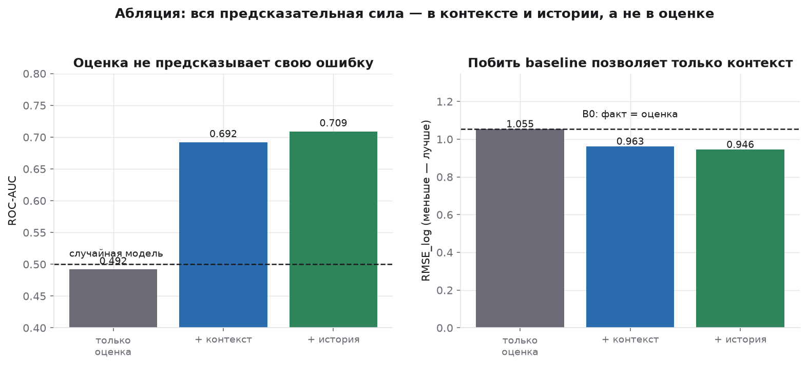

# Predicting and Explaining Software Development Estimation Error

**Почему разработчики ошибаются в оценках — и можно ли предсказать ошибку заранее**

Исследование 80 709 задач из трёх независимых публичных датасетов, в которых для
каждой задачи известны **и оценка, и фактические трудозатраты**.

[](https://colab.research.google.com/github/erdankud/dev_estimations_analysis/blob/main/notebooks/Dev_Estimations_Analysis.ipynb)

📄 **[Полный отчёт с графиками → reports/final_report.docx](reports/final_report.docx)** (Word)

---

## Главный результат

**Предсказуема не задача, а обстоятельства.**

Модель, знающая только оценку разработчика, предсказывает недооценку с ROC-AUC
**0.49** — не лучше подбрасывания монеты. Добавляем контекст (кто, какой проект,
какая фаза) — AUC поднимается до **0.71**.

> В самой оценке нет информации о том, ошибочна ли она. Разработчик не «немного
> знает» о своей ошибке — он не знает о ней ничего.



## Из семи гипотез три опровергнуты

| RQ | гипотеза | вердикт |
|---|---|---|
| RQ1 | Разработчики систематически недооценивают | ❌ **опровергнута** — в агрегате переоценка (×0.80 / ×0.86 / ×0.95) |
| RQ2 | Крупные задачи недооценивают сильнее | ❌ **опровергнута, знак обратный** — регрессия к среднему |
| RQ3 | Точность зависит от исполнителя | ⚠️ подтверждена в CESAW (R² 0.10), но не в SiP (0.03) |
| RQ4 | Проект объясняет часть вариации | ⚠️ подтверждена, эффект мал (0.03) |
| RQ5 | Тип работы влияет | ⚠️ подтверждена, эффект мал (0.04) |
| RQ6 | Прерывания связаны с ошибкой | ✅ **подтверждена — сильнейший фактор** (×2 при контроле размера) |
| RQ7 | Круглые оценки менее точны | ❌ **не подтверждена** — сырой эффект оказался артефактом размера задачи |

## Остальные находки

| | |
|---|---|
| 🎭 | **34 % «идеальных оценок» в SiP — учётный артефакт.** Доля точных совпадений `факт == оценка` падает с 60 % на получасовых задачах до 1 % на многодневных: это списание времени по плану, а не точность. Без изоляции этих строк все метрики врут. |
| 📉 | **Регрессия к среднему воспроизводится на всех трёх датасетах** — разные индустрии, культуры, единицы измерения (минуты, часы, помидоры). Наклоны −0.17 / −0.24 / −0.81, все `p < 1e−140`. |
| 🧱 | **Потолок объяснимости низкий.** Все наблюдаемые факторы вместе объясняют 17 % дисперсии в CESAW и 14 % в SiP. **83–86 % — не объясняется ничем.** |
| 🔀 | **Стратегия разбиения меняет выводы сильнее выбора модели:** ROC-AUC 0.775 (случайное) / 0.738 (новые проекты) / 0.709 (временное). Отчёт по случайному сплиту завысил бы всё. |
| 📊 | **ML выигрывает на мелких задачах и проигрывает на крупных** (+6.6 % на задачах 2–4 ч, −36.6 % на задачах > 16 ч). Общая цифра «выигрыш 10 %» без этой разбивки вводила бы в заблуждение. |
| 📏 | **Правильный продукт — интервал.** Conformal-калибровка поднимает покрытие с 73 % до 78 % при номинальных 80 %. До номинала не дотягивает — процесс нестационарен, и заявлять 80 % было бы неправдой. |

## Данные

| датасет | задач | единицы | период | роль |
|---|---:|---|---|---|
| [**CESAW**](https://arxiv.org/abs/2106.03679) | 60 284 | минуты | 2008–2017 | основной: 247 человек, 45 проектов |
| [**SiP**](https://arxiv.org/abs/1901.01621) | 10 266 | часы | 2004–2014 | валидация на другой организации |
| [**Renzo Pomodoro**](https://shape-of-code.com/2019/12/15/the-renzo-pomodoro-dataset/) | 10 159 | помидоры | 2009–2019 | валидация на одном человеке |

Источник: [Derek-Jones/Software-estimation-datasets](https://github.com/Derek-Jones/Software-estimation-datasets).
Данные не хранятся в репозитории — скачиваются при запуске.

## Структура

```
├── PROJECT_CONTEXT.md                    ← постановка задачи и методологические правила
├── DATA_DICTIONARY.md                    ← словарь переменных (Phase 0)
├── reports/
│   ├── final_report.docx                 ← полный отчёт (Word)
│   └── figures/                          ← 16 графиков
├── notebooks/
│   └── Dev_Estimations_Analysis.ipynb    ← ноутбук для Google Colab
├── src/
│   └── analysis.py                       ← весь пайплайн (percent-формат)
├── build_notebook.py                     ← собирает ноутбук из analysis.py
├── results/                              ← 34 таблицы с метриками (CSV)
└── requirements.txt
```

`src/analysis.py` написан в percent-формате (`# %%` / `# %% [markdown]`) — он
одновременно исполняемый скрипт и источник ноутбука, поэтому код не дублируется
и не расходится между артефактами.

## Как запустить

**Google Colab** — откройте [ноутбук](notebooks/Dev_Estimations_Analysis.ipynb)
по бейджу выше. Зависимости и данные подтягиваются первой ячейкой,
полный прогон ~2 минуты.

**Локально:**

```bash
git clone https://github.com/erdankud/dev_estimations_analysis
cd dev_estimations_analysis
pip install -r requirements.txt

python src/analysis.py        # скачает данные, посчитает всё, запишет reports/ и results/
python build_notebook.py      # пересобрать ноутбук после правок в analysis.py
```

## Методология

Правила зафиксированы **до** моделирования (подробно — в [PROJECT_CONTEXT.md](PROJECT_CONTEXT.md)):

* **Понимание данных предшествует моделированию.** Что означает одна строка в CESAW,
  выяснялось перебором ключей: `(project, wbs, plan_item, phase, person)` — единственный
  уникальный, и агрегация сеансов по нему воспроизводит факт для 99.3 % задач.
* **Ничего не удаляется молча** — журнал очистки в `results/01_cleaning_log.csv`.
* **Всё в логарифмах.** `exp(MAE_log)` читается как «типичная ошибка в N раз».
* **Защита от утечек.** Признаки — только то, что известно в момент оценки.
  Прерывания и число сеансов исключены, хотя это сильнейший фактор (RQ6).
  Исторические признаки — расширяющееся среднее со сдвигом, отсутствие утечки
  проверяется `assert`-ом.
* **Три стратегии разбиения** вместо одной; отчёт по временному.
* **Baseline обязателен** — «факт = оценка», и он очень силён.
* **Значимость ≠ величина эффекта.** Для факторов с большим числом уровней
  (`person` — 246) считается скорректированный и out-of-sample R².
* **Конфаундеры проверяются** — так развалилась гипотеза RQ7.

## Стек

`pandas` · `numpy` · `scipy` · `scikit-learn` (`HistGradientBoosting`,
`RandomForest`, `LogisticRegression`, квантильная регрессия, permutation
importance) · `shap` · `matplotlib`
