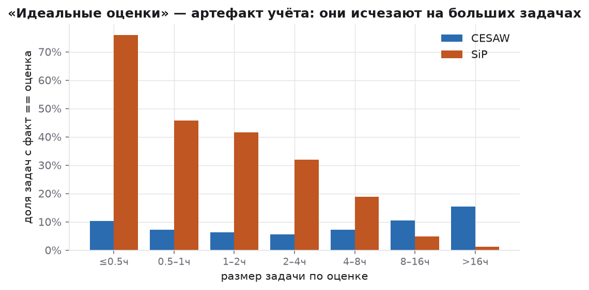
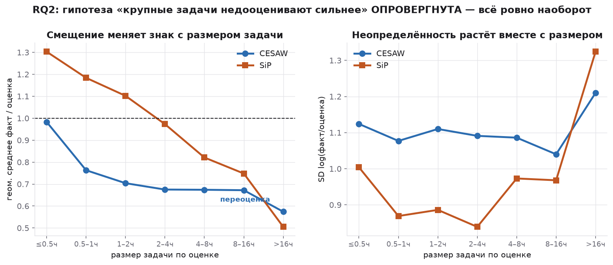
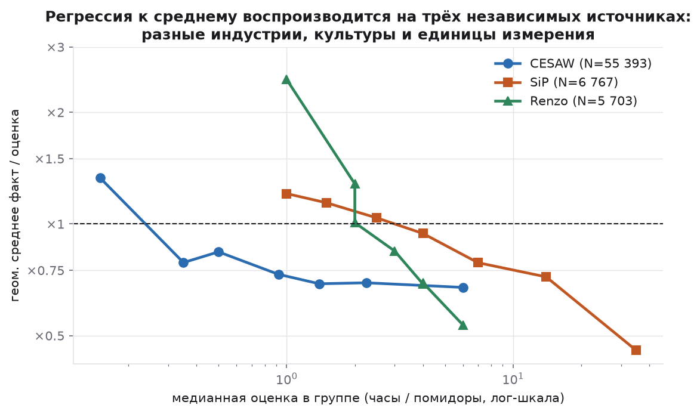
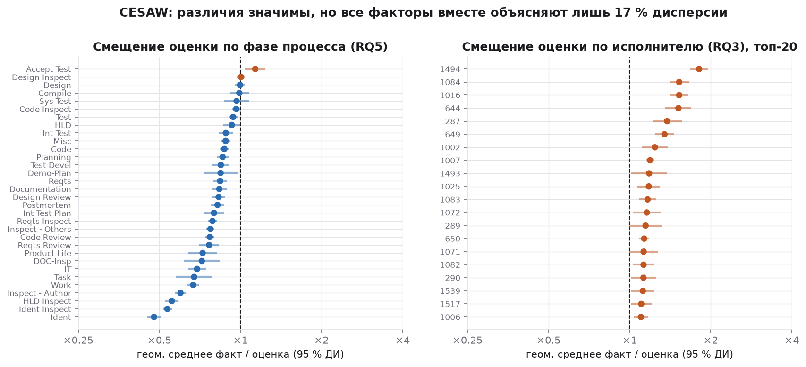
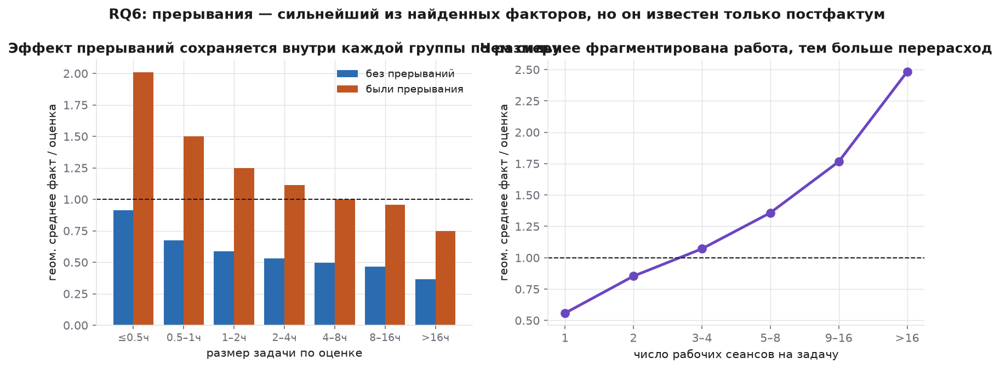
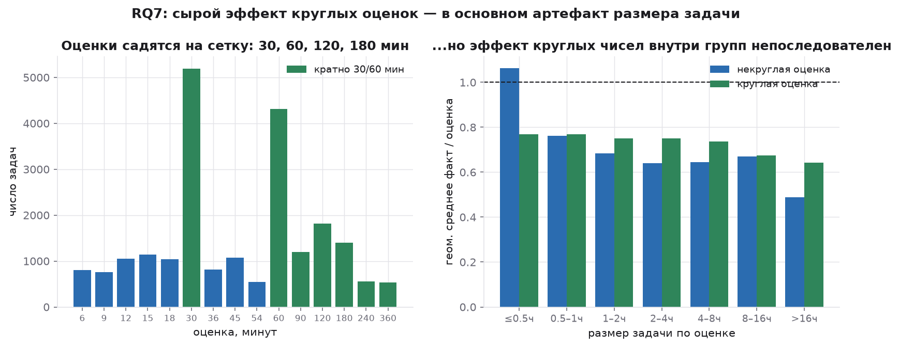
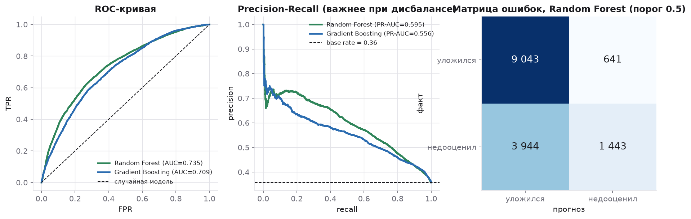
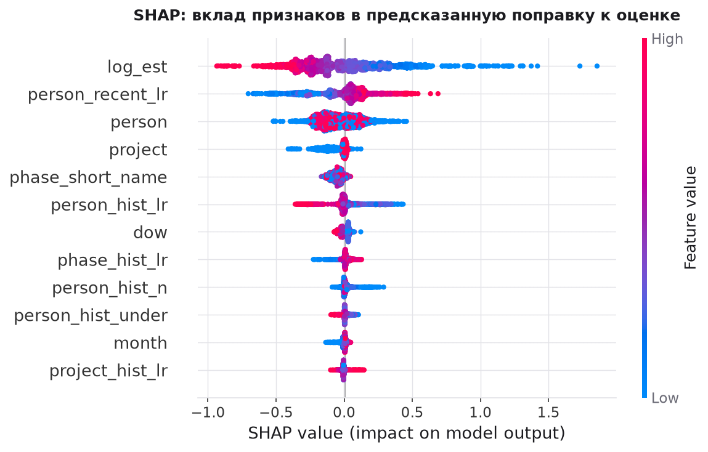
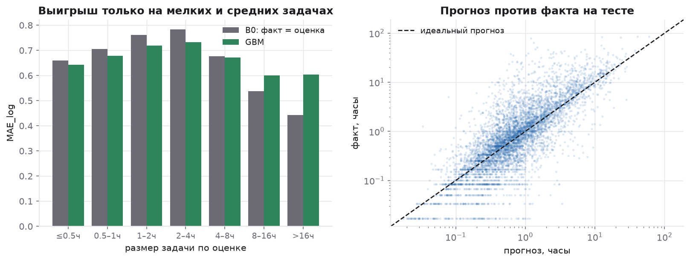
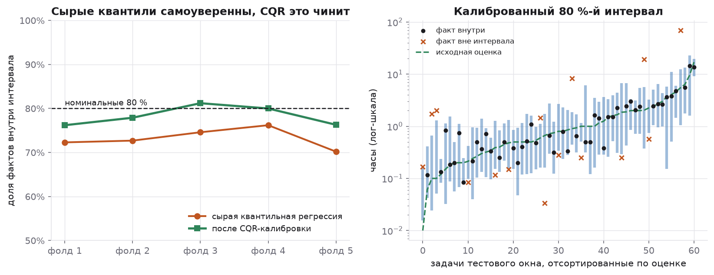

# Почему разработчики ошибаются в оценках

**Исследование 80 709 задач из трёх независимых источников: что предсказуемо в ошибке оценки, а что нет**

Данные: [Derek Jones — Software estimation datasets](https://github.com/Derek-Jones/Software-estimation-datasets)
Код: [`src/analysis.py`](../src/analysis.py) · Ноутбук: [`notebooks/`](../notebooks/Dev_Estimations_Analysis.ipynb)

---

## Резюме

Центральный вопрос проекта: **можно ли предсказать, что задача будет недооценена,
и какие факторы объясняют ошибку оценки?**

Короткий ответ: **предсказуема не задача, а обстоятельства.** Модель, знающая только
оценку разработчика, предсказывает недооценку на уровне подбрасывания монеты
(ROC-AUC 0.49). Как только добавляется контекст — кто, какой проект, какая фаза —
AUC поднимается до 0.71. В самой оценке информации о её ошибке нет.

Из семи проверяемых гипотез **три опровергнуты**, включая обе самые популярные.

| RQ | гипотеза | вердикт |
|---|---|---|
| RQ1 | Разработчики систематически недооценивают | **опровергнута** — в агрегате переоценка |
| RQ2 | Крупные задачи недооценивают сильнее | **опровергнута, знак обратный** |
| RQ3 | Точность зависит от исполнителя | подтверждена в CESAW (R² 0.10), не в SiP (0.03) |
| RQ4 | Проект объясняет часть вариации | подтверждена, эффект мал (0.03) |
| RQ5 | Тип работы влияет | подтверждена, эффект мал (0.04) |
| RQ6 | Прерывания связаны с ошибкой | **подтверждена, сильнейший фактор** |
| RQ7 | Круглые оценки менее точны | **не подтверждена** — конфаундер |

---

## 1. Данные и метод

| датасет | задач | единицы | период | роль |
|---|---:|---|---|---|
| **CESAW** | 60 284 | минуты | 2008–2017 | основной: 247 человек, 45 проектов, есть прерывания |
| **SiP** | 10 266 | часы | 2004–2014 | валидация на другой организации |
| **Renzo Pomodoro** | 10 159 | помидоры | 2009–2019 | валидация на одном человеке |

CESAW выбран основным: достаточно данных для неигрушечного ML, и, в отличие от
PROMISE/COCOMO (где строка — целый проект), здесь есть пара estimate → actual
на уровне **отдельной задачи**.

**Всё считается в логарифмах.** `actual/estimate` — положительная скошенная
величина (максимум ×298). В логах ошибки «в 2 раза дольше» и «в 2 раза быстрее»
симметричны, среднее `log_ratio` = логарифм геометрического среднего,
а `exp(MAE_log)` читается как «типичная ошибка в N раз».

### Что означает одна строка — и почему это заняло больше времени, чем ML

Описание CESAW заявляет «203 621 наблюдение». Это **не задачи**: архив содержит
две таблицы — 61 817 задач и 203 621 *сеанс работы* (включение таймера).
Связь между ними не документирована. Ключ восстановлен перебором:

| проверенный ключ | групп из 61 817 строк |
|---|---:|
| `(project, wbs, plan_item)` | 51 582 — не уникален |
| `+ phase` | 51 582 — не уникален |
| `+ phase, person` | **61 817 — уникален** ✔ |

Подтверждение, а не совпадение: агрегация сеансов по этому ключу воспроизводит
`task_actual_time_minutes` для **99.3 %** задач.

Аналогичная ловушка в SiP: 12 299 строк, но 10 266 задач — многолюдные задачи
записаны несколькими строками с **продублированными** оценкой и фактом. Без
дедупликации крупные задачи получают вес ×2–×5.

Полный журнал решений об очистке — `results/01_cleaning_log.csv`.

---

## 2. Ловушка, которую надо снять до любого моделирования

**У 8 % задач CESAW, 34 % SiP и 44 % Renzo факт в точности равен оценке.**



Это не идеальные оценки. Доля точных совпадений падает с ~60 % на получасовых
задачах до ~1 % на многодневных: списать время «по плану» легко на короткой
задаче и невозможно на длинной. Это учётная практика.

Почему это критично: baseline «факт = оценка» получает на этих строках нулевую
ошибку бесплатно, и по медианным метрикам его становится почти невозможно побить.
Поэтому все ключевые результаты считаются **дважды** — на всех данных и на
подвыборке без точных совпадений.

Именно поэтому CESAW (8 %) — более честная основа, чем SiP (34 %).

---

## 3. RQ1–RQ2: систематической недооценки нет, есть регрессия к среднему

### RQ1 — гипотеза опровергнута

| | CESAW | SiP | Renzo |
|---|---:|---:|---:|
| N | 55 393 | 6 767 | 5 703 |
| доля недооценённых | 42.4 % | 45.6 % | 49.1 % |
| геом. среднее `actual/estimate` | **0.799** | **0.860** | **0.947** |
| p (`log_ratio` vs 0) | < 1e−300 | 4e−32 | 8e−7 |

Во всех трёх источниках смещение направлено **в сторону переоценки**. Фольклор
«умножай на два» ошибается не в величине, а в знаке.

Любопытная деталь по Renzo: знаковый тест не отвергает 50 % (`p = 0.20`),
а t-тест на `log_ratio` отвергает (`p = 8e−7`). Противоречия нет — задачи
превышают оценку примерно в половине случаев, но по величине превышения меньше
занижений. Человек откалиброван по частоте, но не по величине.

### RQ2 — гипотеза опровергнута, знак обратный



| размер | CESAW | SiP |
|---|---:|---:|
| ≤ 0.5 ч | ×0.98 | **×1.30** |
| 0.5–1 ч | ×0.76 | ×1.18 |
| 1–2 ч | ×0.70 | ×1.10 |
| 2–4 ч | ×0.68 | ×0.97 |
| 4–8 ч | ×0.67 | ×0.82 |
| 8–16 ч | ×0.67 | ×0.75 |
| > 16 ч | **×0.57** | **×0.51** |

Наклон `log_ratio ~ log_est` отрицателен везде: CESAW −0.169, SiP −0.240,
Renzo −0.805, все `p < 1e−140`. Механизм — **регрессия к среднему**: оценка
это шумный сигнал, и экстремальные оценки в обе стороны стягиваются к типичной
длительности задачи.

В SiP смещение буквально меняет знак (×1.30 → ×0.51). В CESAW знак не меняется,
но тренд тот же. У одного человека (Renzo) наклон в 3–5 раз круче: без
организационного усреднения эффект виден ярче всего.



**Практический вывод:** единый «коэффициент запаса» на команду вреден — он
ошибается в разные стороны на разных задачах. Калибровать надо по размеру:
мелкое умножать, крупное делить.

---

## 4. RQ3–RQ5: значимо ≠ важно, и главный фактор зависит от организации

Наивный R² обманчив: у `person` в CESAW 246 уровней, то есть 246 дамми-переменных.
Поэтому считаем скорректированный и **out-of-sample** R² (5-фолдовая CV) —
последний нельзя накрутить числом уровней.

| фактор | CESAW: R² | R² скорр. | **R² out-of-sample** | SiP: R² out-of-sample |
|---|---:|---:|---:|---:|
| исполнитель | 0.112 | 0.108 | **0.103** | 0.026 |
| фаза / тип работы | 0.044 | 0.042 | 0.040 | 0.023 |
| проект | 0.032 | 0.031 | 0.030 | 0.012 |
| размер задачи | 0.021 | 0.021 | 0.021 | **0.080** |
| **все факторы вместе** | 0.182 | 0.176 | **0.170** | **0.137** |



Два вывода.

**Доминирующий фактор различается между организациями.** В CESAW сильнее всего
исполнитель (10 % дисперсии; эффект переживает и корректировку, и кросс-валидацию —
значит настоящий). В SiP наоборот: исполнитель почти ничего не даёт, а размер
задачи объясняет 8 %. Переносить «у нас главное — кто оценивает» между компаниями
нельзя: это свойство организации, а не разработки как таковой.

**Потолок низкий.** Все наблюдаемые факторы вместе объясняют 17 % дисперсии
в CESAW и 14 % в SiP. То есть **83–86 % дисперсии ошибки оценки не объясняется
ничем из того, что записано в данных.** Отсюда прямо следует раздел 7: точечный
прогноз обречён, и правильный продукт — интервал.

---

## 5. RQ6: фрагментация работы — сильнейший найденный фактор



| размер задачи | без прерываний | были прерывания |
|---|---:|---:|
| ≤ 0.5 ч | ×0.92 | **×2.01** |
| 0.5–1 ч | ×0.68 | ×1.50 |
| 1–2 ч | ×0.59 | ×1.25 |
| 2–4 ч | ×0.53 | ×1.11 |
| 4–8 ч | ×0.50 | ×1.00 |
| 8–16 ч | ×0.47 | ×0.96 |
| > 16 ч | ×0.37 | ×0.75 |

Эффект **сохраняется внутри каждой группы по размеру** и по величине превосходит
всё, что дали RQ3–RQ5: прерванные задачи перерасходуют примерно вдвое сильнее.
То же по числу рабочих сеансов — от ×0.59 при одном сеансе до ×2.37 при более
чем шестнадцати.

**Но выводы отсюда ограничены дважды.** Направление причинности не установлено:
прерывания могут удлинять задачу, а могут быть *следствием* того, что задача
оказалась тяжелее и растянулась на много дней. И для прогноза это бесполезно:
в момент оценки прерываний ещё нет, поэтому в признаки модели они не вошли.

---

## 6. RQ7: как разваливается красивая гипотеза

Исходная работа по CESAW отмечает склонность к круглым числам как фактор точности.
Сырое сравнение подтверждает: круглые оценки дают ×0.77, некруглые ×0.83.



Но медианная круглая оценка — 1 час, а некруглая — 0.72 часа. **Круглые оценки
просто чаще ставят на более крупные задачи**, а крупные задачи по RQ2 переоцениваются.
При сравнении внутри групп по размеру направление эффекта перестаёт быть
последовательным: в одних группах круглые оценки точнее, в других хуже.

**Наблюдаемый эффект объясняется размером задачи, а не «округлостью».**
Конфаундер здесь — размер, и он коррелирует почти со всем в этих данных.

---

## 7. Машинное обучение

### 7.1 Стратегия разбиения меняет выводы сильнее выбора модели

Данные содержат повторные наблюдения по людям и проектам. Случайное разбиение
позволяет модели увидеть того же человека в том же проекте и в train, и в test.

| стратегия | что проверяет | выигрыш RMSE | ROC-AUC | PR-AUC |
|---|---|---:|---:|---:|
| **A. Случайное** | базовая обучаемость | 18.5 % | 0.775 | 0.688 |
| **B. Новые проекты** | перенос на новый проект | 12.7 % | 0.738 | 0.648 |
| **C. Временное** | прогноз будущего по прошлому | **10.2 %** | **0.709** | **0.556** |

Отчёт по случайному сплиту завысил бы всё. Дальше везде используется **C** —
единственная стратегия, соответствующая реальному сценарию.

### 7.2 Регрессия: предсказать величину ошибки

Предсказываем `log_ratio` (поправку к оценке), а не `log(actual)` — так оценка
разработчика остаётся опорной точкой.

| модель | MAE_log | типичная ошибка | RMSE_log | MdMRE | PRED(25) |
|---|---:|---|---:|---:|---:|
| константа | 1.242 | ×3.46 | 1.569 | 0.808 | 0.133 |
| **B0: факт = оценка** | 0.694 | ×2.00 | 1.053 | 0.408 | 0.390 |
| B1: глобальный ×0.80 | 0.729 | ×2.07 | 1.041 | 0.405 | 0.383 |
| B2: лог-линейная калибровка | 0.750 | ×2.12 | 1.045 | 0.452 | 0.297 |
| M1: Ridge + признаки | 0.739 | ×2.09 | 1.003 | 0.547 | 0.249 |
| **M2: Gradient Boosting** | **0.673** | **×1.96** | **0.946** | 0.429 | 0.331 |

### 7.3 Классификация: предсказать сам факт недооценки

Base rate на тесте — 35.7 %, поэтому accuracy малоинформативна; смотрим PR-AUC.

| модель | accuracy | precision | recall | F1 | ROC-AUC | PR-AUC |
|---|---:|---:|---:|---:|---:|---:|
| Baseline: доля класса | 0.643 | 0.000 | 0.000 | 0.000 | 0.500 | 0.357 |
| Логистическая регрессия | 0.680 | 0.596 | 0.328 | 0.423 | 0.693 | 0.548 |
| Дерево решений (depth=6) | 0.670 | 0.560 | 0.359 | 0.438 | 0.663 | 0.503 |
| **Random Forest** | **0.696** | **0.692** | 0.268 | 0.386 | **0.735** | **0.595** |
| Gradient Boosting | 0.680 | 0.596 | 0.324 | 0.419 | 0.709 | 0.556 |



Random Forest оказался лучше бустинга и по ROC-AUC, и по PR-AUC — усложнение
модели не всегда окупается. Recall низкий (0.27): при пороге 0.5 модель находит
лишь четверть недооценённых задач, зато с точностью 0.69. Порог, разумеется,
настраивается под цену ошибки.

### 7.4 Главный эксперимент: откуда берётся предсказательная сила


| набор признаков | MAE_log | RMSE_log | ROC-AUC | PR-AUC |
|---|---:|---:|---:|---:|
| **только оценка** | 0.766 | 1.055 | **0.492** | 0.348 |
| + контекст (проект / фаза / человек) | 0.689 | 0.963 | 0.692 | 0.539 |
| + история (leak-free) | **0.673** | **0.946** | **0.709** | 0.556 |

*(B0 «факт = оценка»: MAE_log 0.694, RMSE_log 1.053)*

**Это ключевой результат проекта.** Модель, знающая только оценку, предсказывает
недооценку с ROC-AUC 0.49 — **не лучше монетки**, и по MAE она хуже, чем просто
поверить оценке.

Иначе говоря: *в самой оценке нет информации о том, ошибочна ли она.*
Разработчик не «немного знает» о своей ошибке — он не знает о ней ничего.

Вся предсказательная сила появляется вместе с контекстом. Ответ на RQ8:
**предсказать недооценку можно, но не по оценке — по обстоятельствам.**

### 7.5 Исторические признаки без утечек

Самый ценный признак — «насколько этот человек ошибался раньше». Наивный
`groupby(person).log_ratio.mean()` использовал бы будущее. Правильно —
расширяющееся среднее со сдвигом на шаг в хронологическом порядке. Отсутствие
утечки проверяется автоматически: у первой задачи каждого исполнителя история
обязана быть `NaN`.

Вклад скромный (AUC 0.692 → 0.709), и показательно, что *недавняя* точность
(`person_recent_lr`, скользящее окно 10 задач) работает заметно лучше, чем
накопленная за всё время: поведение оценщика дрейфует.

---

## 8. Объяснимость



Permutation importance и SHAP согласуются: доминируют `log_est`, `person`,
`person_recent_lr` и `phase_short_name`. `is_round` не даёт ничего — независимое
подтверждение вердикта по RQ7. `person_hist_lr` (накопленная история) уступает
`person_recent_lr` (недавняя) — ещё одно свидетельство дрейфа.

### Где модель ошибается

| размер задачи | N | B0 MAE_log | GBM MAE_log | выигрыш |
|---|---:|---:|---:|---:|
| ≤ 0.5 ч | 5 618 | 0.660 | 0.642 | +2.7 % |
| 0.5–1 ч | 3 341 | 0.706 | 0.679 | +3.8 % |
| 1–2 ч | 2 558 | 0.761 | 0.719 | +5.5 % |
| 2–4 ч | 1 676 | 0.783 | 0.732 | +6.6 % |
| 4–8 ч | 1 064 | 0.677 | 0.671 | +0.9 % |
| 8–16 ч | 644 | 0.538 | 0.600 | **−11.6 %** |
| > 16 ч | 170 | 0.442 | 0.604 | **−36.6 %** |



**На крупных задачах модель проигрывает baseline, и заметно.** Причина видна
по столбцу N: крупных задач мало, а разброс на них максимален. Модель тянет
прогноз к типичному поведению и систематически их занижает (среднее смещение −0.24).

Практический вывод: применять модель осмысленно только на мелких и средних
задачах, а на крупных честнее оставить оценку разработчика. Общая цифра
«выигрыш 10 %» без этой разбивки вводила бы в заблуждение.

---

## 9. Что можно реально отдать команде

### Персональная калибровка работает наполовину

| модель | MAE_log | RMSE_log |
|---|---:|---:|
| B0: факт = оценка | **0.694** | 1.053 |
| персональный коэффициент (≥5 прошлых задач) | 0.716 | 0.997 |
| персональный коэффициент (≥20 прошлых задач) | 0.716 | 0.999 |
| глобальный коэффициент ×0.80 | 0.729 | 1.041 |
| **Gradient Boosting** | **0.673** | **0.946** |

Персональный коэффициент улучшает RMSE, но **ухудшает MAE**: помогает на выбросах,
вредит на типичной задаче. Порог истории ничего не меняет — дело не в объёме
данных, а в том, что персональное смещение объясняет слишком мало (RQ3).

### Интервал вместо числа

Если 83–86 % дисперсии нередуцируемы, точечный прогноз бессмысленен. Строим
квантильную регрессию (10 % и 90 % квантили `log_ratio`) и калибруем методом
**conformalized quantile regression**.



| | покрытие | медианная ширина |
|---|---:|---:|
| сырая квантильная регрессия | 73.2 % | ×6.1 |
| после CQR-калибровки | **78.3 %** | ×8.0 |

Номинал — 80 %. Калибровка поднимает покрытие с 73 % до 78 %, но **до номинала
не дотягивает**: обменность нарушена нестационарностью процесса. Заявлять ровно
80 % было бы неправдой.

**Что на самом деле означает оценка разработчика** (80 %-й диапазон):

| оценка | нижняя граница | верхняя граница | фактическое покрытие |
|---|---:|---:|---:|
| ≤ 0.5 ч | ×0.35 | ×3.0 | 0.79 |
| 0.5–1 ч | ×0.30 | ×2.4 | 0.75 |
| 1–2 ч | ×0.29 | ×2.15 | 0.75 |
| 2–4 ч | ×0.26 | ×1.98 | 0.74 |
| 4–8 ч | ×0.26 | ×2.06 | 0.72 |
| 8–16 ч | ×0.32 | ×1.71 | 0.69 |

Интервалы широкие — это не недостаток модели, а **измеренное свойство предметной
области**.

---

## 10. Выводы

**Об оценках:**

1. **«Идеальные оценки» надо проверять первыми.** Доля точных совпадений в разрезе
   размера задачи — бесплатный тест на здоровье данных. Падает с 60 % до 1 % —
   значит, вы измеряете дисциплину списания, а не точность.
2. **Систематической недооценки нет — есть регрессия к среднему.** Воспроизводится
   на трёх независимых источниках с разными индустриями и единицами измерения.
3. **Доминирующий фактор зависит от организации** (исполнитель в CESAW, размер
   задачи в SiP), но потолок везде низкий: 83–86 % дисперсии не объясняется ничем.
4. **Фрагментация работы — сильнейший найденный фактор** (×2 внутри каждой группы
   по размеру), но причинность не установлена и для прогноза он недоступен.
5. **Эффект круглых чисел не подтвердился** — это артефакт размера задачи.

**О предсказуемости:**

6. **В самой оценке нет информации о её ошибке** (ROC-AUC 0.49). Предсказуемы
   обстоятельства, а не задача.
7. **Стратегия разбиения меняет выводы сильнее выбора модели.**
8. **ML выигрывает на мелких и средних задачах и проигрывает на крупных.**
9. **Персональные коэффициенты работают наполовину.**
10. **Отдавать надо интервал — и честно сообщать, что он не дотягивает до номинала.**

**Что делать команде:**

- Проверить свой учёт до построения любых дашбордов точности.
- Отказаться от единого коэффициента запаса; калибровать по размеру задачи.
- Посчитать, что доминирует именно у вас — это одна таблица R², и она определяет,
  куда прикладывать усилия.
- Защищать фокус: фрагментация — единственный сильный управляемый фактор из найденных.
- Планировать интервалами. Оценка «4 часа» здесь означает 80 %-й диапазон
  примерно от часа до восьми.

---

## 11. Ограничения

- **Наблюдательные данные.** Неизвестно, влияла ли оценка на факт: разработчик мог
  подгонять работу под названный срок (self-fulfilling prophecy). Без эксперимента
  это неразделимо.
- **Survivorship bias.** Незакрытых и отменённых задач в датасетах нет; выводы,
  вероятно, смещены в оптимистичную сторону.
- **RQ6 не причинный.** Связь прерываний с перерасходом установлена, направление — нет.
- **Обменность для CQR нарушена**, поэтому покрытие проверялось эмпирически
  на каждом окне (0.76–0.81) и не дотягивает до номинальных 80 %.
- **CESAW — специфическая среда** (формальный TSP-процесс, часть проектов
  safety-critical). SiP и Renzo подтверждают направление эффектов, но не величину.
- **Модель непригодна для крупных задач** — см. раздел 8.

## 12. Что дальше

- Иерархическая байесовская модель: частичный пулинг по исполнителю и фазе даст
  устойчивые оценки для редких категорий вместо шумных групповых средних —
  и, вероятно, починит провал на крупных задачах.
- Модель цензурированных наблюдений для незакрытых задач (снять survivorship bias).
- Агрегация на уровень спринта: гасят ли ошибки отдельных задач друг друга или
  складываются? Для планирования это главный вопрос, и данные CESAW позволяют его задать.
- Иерархия WBS (`wbs_parent.csv`) осталась незадействованной.

---

## Воспроизведение

```bash
pip install -r requirements.txt
python src/analysis.py        # ~2 минуты, пишет reports/figures/ и results/
```

Или открыть [ноутбук](../notebooks/Dev_Estimations_Analysis.ipynb) в Google Colab —
данные скачиваются автоматически.
